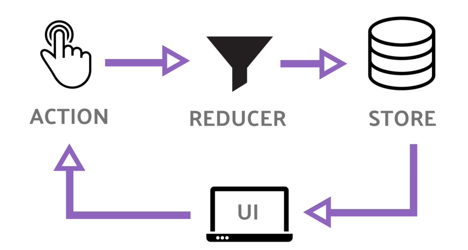

# Introdução ao Redux com Typescript

## O que é Redux?

`Redux` é uma biblioteca de gerenciamento de estado para aplicações JavaScript. Ele ajuda a controlar o estado da aplicação de forma previsível e centralizada. No contexto de uma aplicação `React`, `Redux` é especialmente útil para compartilhar estado entre componentes que não têm uma relação direta pai-filho.

## Por que usar Redux?

`Redux` é útil quando você tem um estado que precisa ser compartilhado por vários componentes em diferentes partes da aplicação. Ele oferece uma maneira previsível e fácil de gerenciar o estado global da aplicação.

## Principais conceitos do Redux:

- **Store**: O estado global da aplicação é *armazenado* em um objeto chamado `store`. O `store` é o _único ponto de verdade do estado na **aplicação**_.

- **Actions**: As `actions` são objetos que descrevem *uma intenção de mudança no estado*. Elas são a _única fonte de informação para o **store**_.

- **Reducers**: Os `reducers` são *funções puras* que *especificam como o estado da aplicação muda em resposta a uma action*. Eles _recebem o **estado atual** e uma **action** e **retornam um novo estado**_.

- **Dispatch**: A função `dispatch` é usada para _enviar actions para o store_. Quando uma `action` é "*despachada*", o `reducer` correspondente é _chamado para **atualizar** o estado da aplicação_.

- **Connect**: Em uma aplicação `React`, o `Redux` pode ser conectado aos componentes usando a função `connect`. Isso permite que _os componentes acessem o **estado global** e **despachem actions**_.



## Mão na Massa: Carrinho de Compras

Vamos agora criar um exemplo prático usando `Redux` com `Next.js` e `TypeScript` para **gerenciar um carrinho de compras**.

### Instalando as dependências

Primeiro, você precisa instalar algumas bibliotecas:

```bash
npm install redux react-redux @reduxjs/toolkit next-redux-wrapper
```

### Criando a estrutura do Redux

1. Criando Actions

```typescript
// actions.ts
export const ADD_TO_CART = 'ADD_TO_CART';
export const REMOVE_FROM_CART = 'REMOVE_FROM_CART';
export const UPDATE_QUANTITY = 'UPDATE_QUANTITY';

export const addToCart = (productId: number) => ({
  type: ADD_TO_CART,
  payload: { productId },
});

export const removeFromCart = (productId: number) => ({
  type: REMOVE_FROM_CART,
  payload: { productId },
});

export const updateQuantity = (productId: number, quantity: number) => ({
  type: UPDATE_QUANTITY,
  payload: { productId, quantity },
});
```

2. Criando Reducer

```typescript
// reducer.ts
import { ADD_TO_CART, REMOVE_FROM_CART, UPDATE_QUANTITY } from './actions';

interface CartItem {
  productId: number;
  quantity: number;
}

const initialState: CartItem[] = [];

const cartReducer = (state = initialState, action: any) => {
  switch (action.type) {
    case ADD_TO_CART:
      return [...state, { productId: action.payload.productId, quantity: 1 }];
    case REMOVE_FROM_CART:
      return state.filter(item => item.productId !== action.payload.productId);
    case UPDATE_QUANTITY:
      return state.map(item =>
        item.productId === action.payload.productId
          ? { ...item, quantity: action.payload.quantity }
          : item
      );
    default:
      return state;
  }
};

export default cartReducer;
```

3. Configurando o Store
   
```typescript
// store.ts
import { configureStore } from "@reduxjs/toolkit";
import cartReducer from "./reducers";

const store = configureStore({
  reducer: {
    cart: cartReducer,
  },
});

export default store;
```

4. Integrando com Next.js usando `next-redux-wrapper`
 
```typescript
// pages/_app.tsx
import { Provider } from 'react-redux';
import { store } from '../path/to/store';
import { AppProps } from 'next/app';

function MyApp({ Component, pageProps }: AppProps) {
  return (
    <Provider store={store}>
      <Component {...pageProps} />
    </Provider>
  );
}
```

### Usando Redux no componente

Agora, você pode usar o Redux no seu componente para acessar o estado global e despachar actions.

```typescript
// components/Product.tsx
import { useDispatch } from 'react-redux';
import { addToCart, removeFromCart, updateQuantity } from '../path/to/actions';

interface ProductProps {
  id: number;
  name: string;
  price: number;
}

const Product: React.FC<ProductProps> = ({ id, name, price }) => {
  const dispatch = useDispatch();

  const handleAddToCart = () => {
    dispatch(addToCart(id));
  };

  const handleRemoveFromCart = () => {
    dispatch(removeFromCart(id));
  };

  const handleQuantityChange = (event: React.ChangeEvent<HTMLInputElement>) => {
    const quantity = parseInt(event.target.value, 10);
    dispatch(updateQuantity(id, quantity));
  };

  return (
    <div>
      <h2>{name}</h2>
      <p>Price: ${price}</p>
      <button onClick={handleAddToCart}>Add to Cart</button>
      <button onClick={handleRemoveFromCart}>Remove from Cart</button>
      <input type="number" value={1} onChange={handleQuantityChange} />
    </div>
  );
};

export default Product;
```

Neste exemplo, o componente `Product` pode adicionar, remover e alterar quantidades dos itens no carrinho de compras usando `Redux`.

Espero que este tutorial ajude você a entender como usar `Redux` com `Next.js` e `TypeScript` para gerenciar o estado global da sua aplicação! Se você tiver mais perguntas ou precisar de mais ajuda, sinta-se à vontade para perguntar.

## Desafio

Monte o seu carrinho de compras com o Redux.
