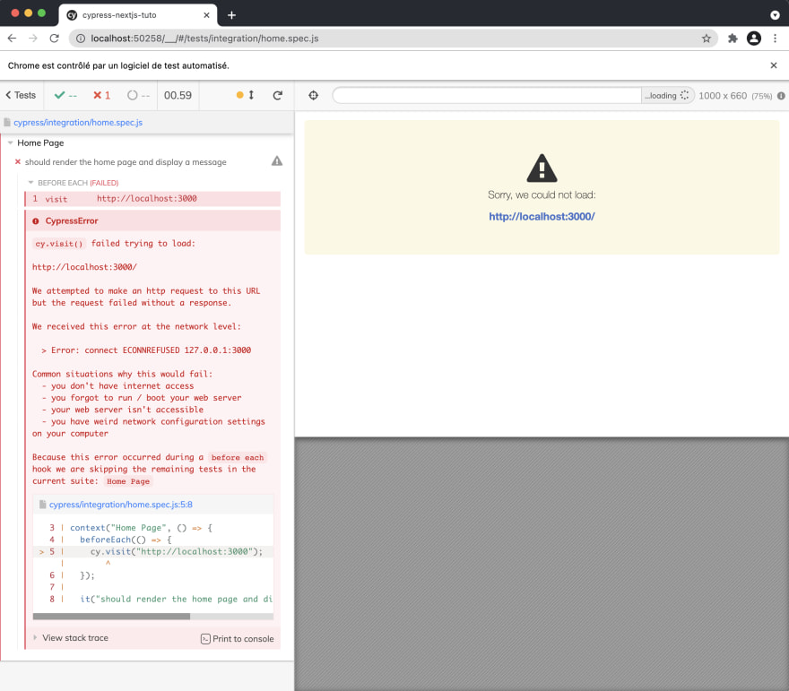

# Testes E2E com Cypress

Os testes `end-to-end` (`E2E`) são fundamentais para garantir que a aplicação funcione corretamente do ponto de vista do usuário, simulando a interação de um usuário real com a aplicação em um ambiente que se assemelha ao ambiente de produção. Em contrapartida, os testes unitários focam em verificar partes isoladas do código, como funções ou métodos, de forma independente. 

Os testes E2E são cruciais para garantir a integridade e o correto funcionamento de uma aplicação. 

## Diferença entre Testes E2E e Testes Unitários:

- **Testes Unitários**: Testam unidades individuais de código, como funções ou métodos, garantindo que cada parte isolada funcione corretamente.

- **Testes E2E**: Verificam o fluxo completo da aplicação, simulando a jornada do usuário, desde a entrada até a saída, garantindo a integração correta de todos os componentes.

## Testes E2E é o mesmo que testes de integração?

Os testes E2E (End-to-End) e os testes de integração são diferentes, embora ambos visem verificar o funcionamento correto de uma aplicação em níveis mais amplos do que os testes unitários.

- **Testes E2E (End-to-End)**: Esses testes simulam a jornada completa do usuário na aplicação, cobrindo todos os componentes, camadas e interações entre eles. Eles geralmente verificam o aplicativo como um todo, desde a entrada do usuário até a saída esperada, envolvendo múltiplas páginas, serviços e recursos. O foco principal é verificar se a aplicação funciona conforme esperado do ponto de vista do usuário final.

- **Testes de Integração**: Eles se concentram em testar a integração entre diferentes partes da aplicação para garantir que essas partes funcionem corretamente juntas. Isso pode incluir testes entre módulos, APIs, serviços ou bancos de dados. Enquanto os testes E2E verificam o fluxo completo da aplicação, os testes de integração se concentram nas conexões e interações entre os componentes da aplicação.

> Portanto, embora os testes E2E possam abranger elementos de testes de integração, eles são mais abrangentes, pois simulam a experiência do usuário completa. Já os testes de integração se concentram mais na verificação da interação entre partes específicas da aplicação.

## Passo a Passo para Realizar Testes E2E em Aplicações com Next.js:

### 1. Configuração do Ambiente:

Instale as dependências necessárias, como `cypress` para testes E2E:

```bash
npm install --save-dev cypress @cypress/typescript-preprocessor
#or 
yarn add -D cypress @cypress/typescript-preprocessor
```

Adicione um script no `package.json` para iniciar o Cypress:

```json
"scripts": {
  "cypress:open": "cypress open"
}
```

Configure o Cypress para suportar Typescript criando um arquivo `tsconfig.json` na pasta raiz do projeto.

```json
// tsconfig.json
{
  "compilerOptions": {
    "target": "es5",
    "lib": ["dom", "dom.iterable", "esnext"],
    "allowJs": true,
    "skipLibCheck": true,
    "strict": true,
    "forceConsistentCasingInFileNames": true,
    "noEmit": true,
    "esModuleInterop": true,
    "module": "esnext",
    "moduleResolution": "node",
    "resolveJsonModule": true,
    "isolatedModules": true,
    "jsx": "preserve",
    "types": ["cypress"] // Se você usar Typescript, certifique-se de adicionar tipos do cypress
  },
  "include": ["next-env.d.ts", "**/*.ts", "**/*.tsx"],
  "exclude": ["node_modules"]
}
```

Adicione uma configuração específica para o Cypress no arquivo `cypress/tsconfig.json`.

```json
// cypress/tsconfig.json
{
  "compilerOptions": {
    "target": "es5",
    "lib": ["dom", "dom.iterable", "esnext"],
    "types": ["cypress"],
    "esModuleInterop": true,
    "allowJs": true,
    "baseUrl": "../node_modules",
    "paths": {
      "*": ["../src/*"]
    }
  },
  "include": ["**/*.ts"]
}
```

### 2. Escrevendo Testes E2E:

Crie um arquivo de teste no diretório `cypress/integration`. Comece descrevendo o fluxo de teste usando comandos do Cypress (como `cy.visit`, `cy.get`, `cy.type`, `cy.click`, etc.) para simular as interações do usuário com a aplicação. 

**Exemplo**: Crie um arquivo de teste E2E no diretório `cypress/integration` (por exemplo, `button.cy.ts`).

```typescript
// cypress/integration/button_spec.ts
describe('Button Component', () => {
  it('should click the button', () => {
    cy.visit('/');
    cy.contains('Test Button').click();
    cy.contains('Button clicked!').should('exist');
  });
});
```

### 3. Executando os Testes:

`npm run cypress:open` ou `yarn cypress:open` executará o Cypress pela primeira vez. Ele irá gerar automaticamente todos os arquivos necessários para você e testar exemplos em uma pasta cypress na raiz do seu projeto, e abrir uma página dedicada no seu navegador

Se você executar este teste, ele falhará e isso é normal quando está usando NextJS.



Para fazer funcionar, precisamos primeiro rodar nosso servidor e lançar os testes, para automatizar esse comportamento instalaremos uma biblioteca chamada `start-server-and-test`

```bash
npm install start-server-and-test --save-dev
# ou
yarn add start-server-and-test -D
```

Adicione um script em seu package.json
  
## Mais exemplos

Vamos supor que você tenha um componente `Header` que exibe a logo, nome da loja e o menu do site.

```tsx
// Header.tsx
import React from 'react';

const Header: React.FC = () => {
  return (
    <header>
      <h1>Minha Loja Geek</h1>
      {/* ... outros elementos do cabeçalho */}
    </header>
  );
};

export default Header;
```

Teste E2E para o Componente Header:

```typescript
describe('Teste do Componente Header', () => {
  it('Deve exibir o cabeçalho corretamente', () => {
    cy.visit('/'); // Supondo que o cabeçalho esteja na página inicial
    cy.get('header').should('contain', 'Minha Loja Geek');
    // Adicione mais verificações conforme necessário para elementos do cabeçalho
  });
});
```

Mais outro exemplo com testes E2E para uma tela de login:

```typescript
describe('Teste de navegação', () => {
  it('Deve navegar para a página de login', () => {
    cy.visit('/login');
    cy.get('input[name="email"]').type('usuario@example.com');
    cy.get('input[name="password"]').type('senha123');
    cy.get('button[type="submit"]').click();
    cy.url().should('include', '/home');
  });
});
```

## Conclusão

Realizar testes E2E em aplicações Next.js com Typescript é essencial para garantir a qualidade do software. Ao simular as interações do usuário, podemos identificar problemas de integração e garantir uma experiência fluida para os usuários finais. Investir tempo na escrita e execução desses testes contribui significativamente para a confiabilidade e robustez da aplicação.

## Docs

- <https://nextjs.org/docs/pages/building-your-application/optimizing/testing>
- <https://dev.to/alexcoding42/how-to-set-up-cypress-in-your-next-js-project-for-integration-test-159j>