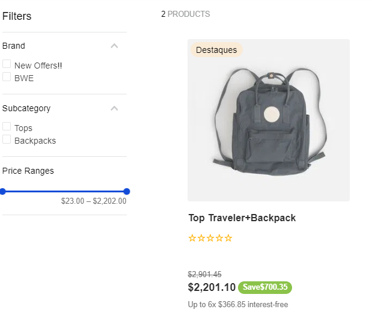
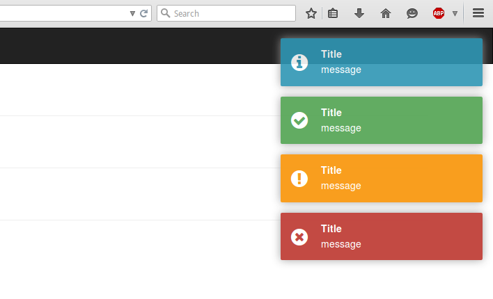
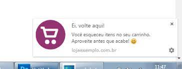
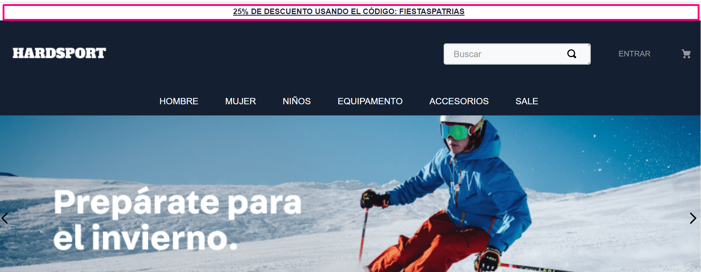
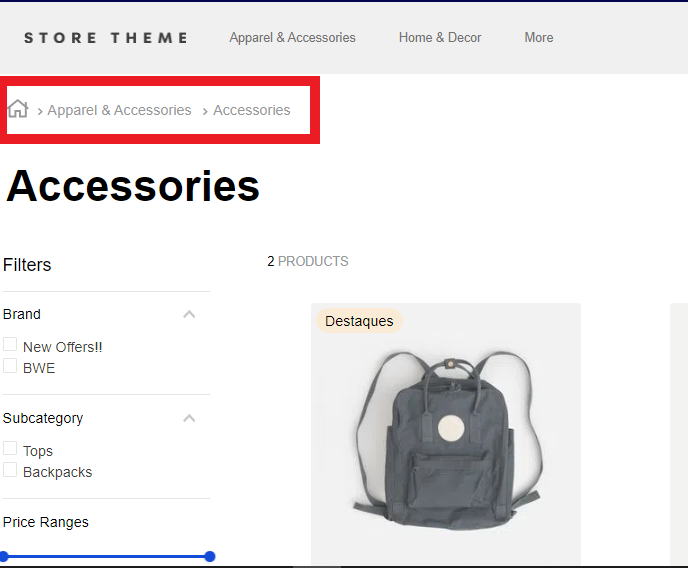
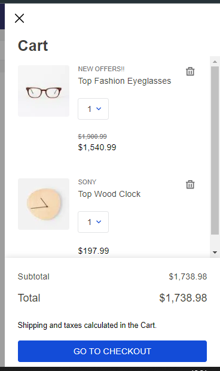
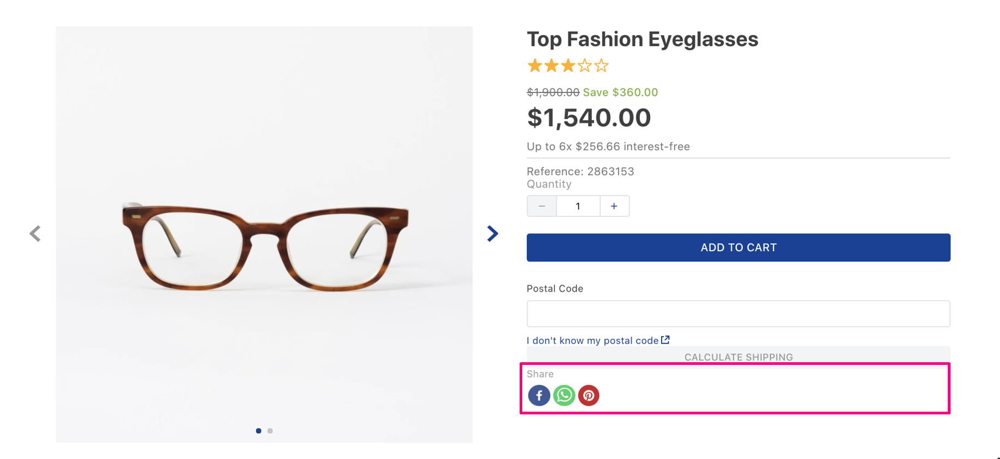

# Título: Maximizando as Vendas em um E-commerce: Estratégias e Recursos do React/Next.js

O comércio eletrônico tornou-se um campo altamente competitivo, onde a customização e a experiência do usuário são fundamentais para o sucesso. Desenvolver um e-commerce eficaz requer não apenas ótimos produtos, mas também uma plataforma robusta e intuitiva. Com o uso inteligente das ferramentas certas, como `React` e `Next.js`, é possível criar um ambiente de compras online que não apenas **atraia**, mas também **retenha** clientes.

## O Poder do `React` e `Next.js` no E-commerce

O React e o Next.js oferecem um conjunto de recursos poderosos que podem ser explorados para melhorar a experiência do usuário e, consequentemente, aumentar as vendas em um e-commerce. Vamos explorar algumas estratégias e recursos específicos que podem ser aplicados:

### 1. Pesquisa Avançada e Filtros de Produtos

Ofereça aos usuários a capacidade de filtrar e encontrar rapidamente o que procuram. O React permite a criação de componentes interativos para facilitar a seleção de filtros, enquanto o Next.js lida com a renderização eficiente das páginas. Utilize bibliotecas de componentes como [`React Select`](https://react-select.com/home) ou [`React-Bootstrap`](https://react-bootstrap.netlify.app/) para criar dropdowns de filtro.

### 2. Carrinho de Compras Interativo

Utilize o estado local do React para gerenciar itens no carrinho, como alterar as quantidades dos produtos adicionados, por exemplo.  O carrinho de compras poderá ser gerenciado por um estado global via `useContext`, ou qualquer biblioteca de gerenciamento de estado como [`Redux`](https://react-redux.js.org/) ou [`Zustand`](https://zustand-demo.pmnd.rs/). Para torna-lo mais interativo com o usuário pode incluir notificações que dê o feedback quando o produto foi excluido do carrinho ou quando não possui mais estoque disponível podem ser desenvolvidos com [`React Notifications`](https://github.com/tjrexer/react-notifications)

### 3. Recuperação de Carrinho Abandonado

Implemente estratégias de recuperação de carrinho abandonado, enviando notificações por e-mail ou até mesmo mensagens personalizadas ao usuário, usando recursos de reatividade para lembrar e incentivar a conclusão da compra. Para isso podemos usar uma funcão no  `return` do `useEffect` pois antes de sair do **componente/página** que mostrará a notificação para o usuário.

### 4. Quick View (Visualização Rápida)

Implemente um modal de visualização rápida dos produtos, permitindo que os usuários vejam detalhes essenciais do produto sem sair da página principal, utilizando componentes modais do React para essa interação dinâmica.

### 5. Topo da página

Em sites de e-commerce, é muito comum notificações de campanhas e mostra ao usuário a promoção atual que ele pode aproveitar.

### 6. Breadcrumbs

Os breadcrumbs são elementos de navegação fundamentais em um e-commerce, oferecendo aos usuários uma trilha clara de sua localização no site. No contexto do artigo sobre o uso de React e Next.js para impulsionar vendas em e-commerces, os breadcrumbs desempenham um papel crucial ao mostrar a hierarquia de páginas visitadas até a página atual. Esses componentes dinâmicos, criados com `React` e aproveitando a estrutura de roteamento do `Next.js`, não apenas orientam os usuários, mas também facilitam o retorno a páginas anteriores, melhorando a experiência do usuário e contribuindo para o aumento das conversões e vendas no ambiente de comércio online.

Por exemplo, suponha que um usuário esteja visualizando um produto específico em um e-commerce que possui categorias como **"Roupas" > "Camisetas" > "Camiseta X"**. Os breadcrumbs exibiriam essa jornada de navegação na parte superior da página, permitindo que o usuário saiba exatamente onde está e oferecendo a opção de retornar facilmente a níveis anteriores.

### 7. Minicart

O minicart, ou carrinho de compras compacto, é uma ferramenta valiosa em e-commerces desenvolvidos com React e Next.js. Este recurso permite que os usuários visualizem rapidamente os itens adicionados ao carrinho sem sair da página atual, oferecendo uma experiência de compra fluida e eficiente. Ao utilizar a capacidade do React para gerenciar o estado local do carrinho e integrá-lo de forma dinâmica e responsiva aos componentes, o minicart torna-se uma funcionalidade conveniente e acessível, permitindo aos usuários verem e editarem facilmente os itens selecionados, o que pode aumentar a conveniência e a conversão de vendas.

A implementação inteligente do minicart em um e-commerce baseado em `React` e `Next.js` não apenas agiliza o processo de compras, mas também mantém os usuários informados sobre suas seleções sem interromper sua navegação. Utilizando recursos interativos do React para gerenciar os itens no carrinho e aprimorando a interface com elementos responsivos, o minicart oferece uma experiência de compra ágil e intuitiva, potencializando a satisfação do cliente e contribuindo para um aumento nas vendas ao simplificar e agilizar o processo de compra.

### 8. CMS de Cadastros

Desenvolva um sistema robusto de gerenciamento de conteúdo para cadastros de produtos, informações de clientes e conteúdo do site. O React pode ser usado para criar interfaces de administração interativas, enquanto o Next.js lida com a exibição desses dados de forma eficiente. Esta área será protegida por login e restrita ao usuário administrador(lojista).

Neste CMS poderá conter: 

- Usuários cadastrados no site e quais deles serão administradores do CMS e outras permições
- Cadastro de Produtos
- Cadastro das opções de Menu 
- Cadastro dos banners e campanhas
- Etc.

### 9. Notificações em Tempo Real

Integre tecnologias como [`WebSocket`](https://www.npmjs.com/package/react-use-websocket) com componentes React para oferecer notificações em tempo real sobre promoções, vendas ou informações de produtos.

### 10. Integração com Redes Sociais

Aproveite os recursos do React para integrar botões de compartilhamento e até mesmo comentários sociais, permitindo uma interação mais ampla com os clientes. Considere bibliotecas prontas para integração social, como [`React Social Sharing`](https://www.npmjs.com/package/react-social-sharing).

### 11. Recomendações Personalizadas

Implemente algoritmos de recomendação para sugerir produtos com base no histórico de compras ou nas preferências do usuário.

Utilize API's de machine learning ou bibliotecas como [`React-Query`](https://tanstack.com/query/v3/docs/react/overview) para gerenciar as solicitações de recomendação.

### 12. Análise e Rastreamento

Integre ferramentas de análise como [`Google Analytics`](https://www.npmjs.com/package/react-ga4) ou [`Mixpanel`](https://github.com/neciu/react-mixpanel#readme), utilizando os recursos do React/Next.js para disparar eventos de rastreamento em páginas específicas, cliques em botões ou transições de página.

## Conclusão

Ao aproveitar ao máximo o potencial do `React` e `Next.js`, os comerciantes online podem impulsionar suas vendas e conquistar a fidelidade dos clientes. A utilização inteligente dessas ferramentas não apenas melhora a usabilidade, mas também pode ser crucial para se destacar em um mercado competitivo. Desenvolver recursos como carrinho abandonado, visualização rápida de produtos, clube de fidelidade e um CMS eficaz permite criar uma experiência de compra envolvente e personalizada, resultando em maior satisfação do cliente e, consequentemente, maior sucesso nas vendas.