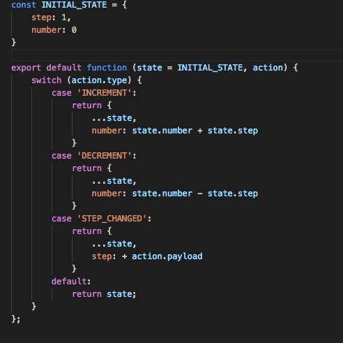
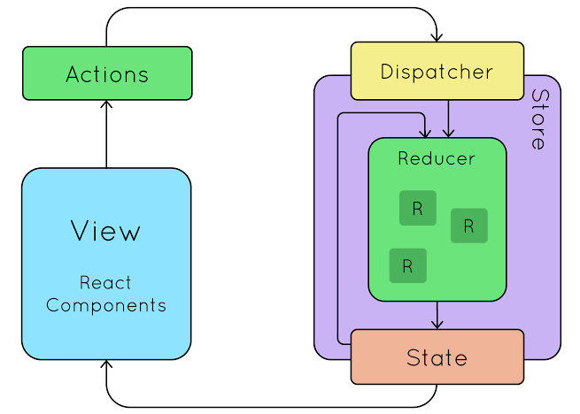

# "O Padrão Reducer e a Arquitetura Flux/Redux: Gerenciamento de Estado em Aplicações Front-end"

O padrão de design conhecido como **"Reducer"** é uma parte fundamental da arquitetura de código **Flux/Redux**, que é amplamente utilizado no desenvolvimento de aplicações web, especialmente em aplicações React, para gerenciar o estado de forma previsível e escalável. Vamos explorar mais detalhadamente esse padrão e sua relação com o Flux/Redux:

## Padrão Reducer

O padrão Reducer é uma função pura que recebe o estado atual e uma ação como entrada e retorna um novo estado. Sua principal responsabilidade é definir como o estado da aplicação deve ser atualizado em resposta a diferentes ações. Aqui está uma visão geral do processo:

- **Estado Inicial**: Inicialmente, você define um estado inicial que representa o estado da sua aplicação.

- **Ações**: Ações são eventos ou objetos que descrevem alguma mudança ou interação na sua aplicação. Cada ação geralmente possui um tipo (uma string que descreve a ação) e opcionalmente dados adicionais relevantes para a ação.

- **Reducer**: Você implementa uma função Reducer que recebe o estado atual e uma ação como argumentos e retorna um novo estado com base na ação recebida. O Reducer é uma função pura, o que significa que ele não deve realizar efeitos colaterais, como chamadas de API ou manipulações diretas no DOM. Ele deve ser determinístico, ou seja, para a mesma entrada, sempre produzirá o mesmo resultado.

- **Dispatch**: Quando ocorre uma interação na sua aplicação que requer uma atualização de estado, você despacha uma ação usando uma função chamada "dispatch". A ação é enviada para o Reducer.

- **Atualização de Estado**: O Reducer processa a ação e atualiza o estado de acordo com a lógica definida. Ele cria um novo objeto de estado imutável, garantindo que o estado anterior não seja modificado diretamente.

- **Notificação de Observadores**: Após a atualização do estado, todos os componentes que estão observando esse estado são notificados e reagem à mudança.

## Arquitetura Flux/Redux

O padrão **Reducer** é uma parte essencial da arquitetura **Flux/Redux**. Essa arquitetura foi desenvolvida para solucionar os desafios de gerenciamento de estado em grandes aplicações front-end, onde o estado compartilhado pode se tornar complexo e difícil de rastrear. A arquitetura Flux introduziu o conceito de um fluxo unidirecional de dados, e o Redux é uma implementação popular dessa arquitetura para aplicações React.

A arquitetura Flux/Redux consiste nos seguintes componentes principais:

- **Store**: A Store é o objeto central que contém o estado global da aplicação. Ela é mantida por um Reducer principal que coordena como o estado é atualizado em resposta a ações.

- **Actions**: As Actions são objetos que descrevem as intenções do usuário ou eventos na aplicação. Elas são enviadas para a Store usando o método "dispatch" e incluem um tipo de ação e, opcionalmente, dados adicionais.

- **Reducer**: O Reducer é uma função que recebe o estado atual e uma ação e retorna um novo estado. Cada parte do estado da aplicação pode ter seu próprio Reducer, e esses Reducers são combinados em um Reducer raiz para criar o estado global da aplicação.

- **View**: As Views (normalmente componentes React) são responsáveis por renderizar a interface do usuário com base no estado atual da Store. Elas também podem enviar ações para a Store quando ocorrem interações do usuário.

- **Dispatcher**: O Dispatcher é uma parte do Flux original e é responsável por enviar as ações para os Reducers apropriados. No Redux, esse papel é geralmente desempenhado pela função "dispatch" fornecida pela biblioteca Redux.

A sequência completa de como as ações são despachadas, processadas pelo Reducer e refletem nas Views cria um ciclo de atualização de estado previsível e unidirecional, tornando o gerenciamento de estado mais controlável e testável em aplicações complexas.

Em resumo, o **padrão Reducer e a arquitetura Flux/Redux** são conceitos essenciais para o desenvolvimento de aplicações front-end escaláveis e previsíveis. Eles promovem a imutabilidade do estado, facilitam o rastreamento de mudanças e ajudam a manter a consistência do estado em toda a aplicação.