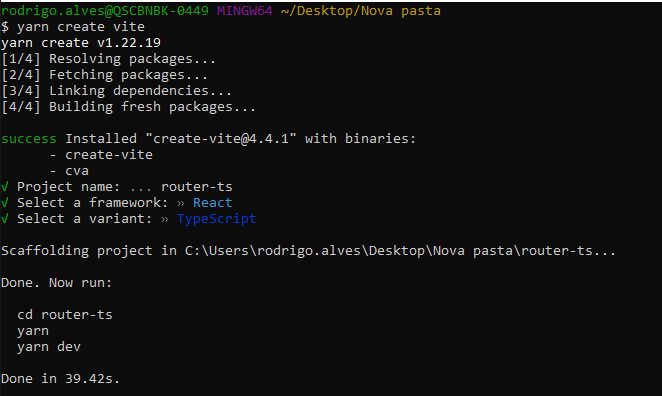

# Introdução ao React Router

O **React Router** é uma biblioteca popular para navegação em aplicativos React. Ele permite que você configure rotas em seu aplicativo para controlar a navegação de uma página para outra sem recarregar a página.

## Como criar rotas em seu projeto

### Passo 1: Configurar um projeto Vite com React

Dessa vez vou ensinar criando um projeto usando o [Vite](https://pt.vitejs.dev/). **Vite** (_palavra francesa para "rápido"_) é uma ferramenta de construção de projetos de frontend que se destina a oferecer uma experiência de desenvolvimento mais rápida e leve para projetos de web modernos. Tende a simplificar o projeto, já que o **NextJS** já vem com vários recursos embutidos e nem são usados na maioria das vezes quando se está aprendendo.

Também no **NextJS** já vem com o recursos de rotas praticamente pronto e **não** é o que vemos atualmente em muitos projetos no mercado.

Primeiro, crie um novo projeto **Vite** usando o seguinte comando:

```bash
npm create vite@latest
#or using yarn
yarn create vite
```

Ao executar o comando, você irá escolher o nome do projeto, qual framework deseja usar e se quer usar `typescript`.



Você poderá simplificar a execução, enviando as opções, usando:

```bash
# npm 7+, extra double-dash is needed:
npm create vite@latest my-react-router-app -- --template react-ts

# yarn
yarn create vite my-react-router-app --template react-ts
```

Após o projeto ser criado, acesse o diretório do projeto:

```bash
cd my-react-router-app
```

### Passo 2: Instalar e Configurar React Router

Instale o **React Router DOM** no seu projeto usando `npm` ou `yarn`:

```bash
npm install react-router-dom @types/react-router-dom --save # use --save for old npm versions
# or
yarn add react-router-dom @types/react-router-dom
```

### Passo 3: Criar Componentes para Páginas

Crie componentes para as páginas `Home`, `About` e `NotFound` no diretório `src/components`.

```tsx
// src/components/Home.tsx
import React from 'react';

function Home() {
  return <h1>Página Inicial</h1>;
};

export default Home;

// src/components/About.tsx
import React from 'react';

function About() {
  return <h1>Página Sobre</h1>;
};

export default About;

// src/components/NotFound.tsx
import React from 'react';

function NotFound() {
  return <h1>404 | Página não encontrada</h1>;
};

export default NotFound;
```


### Passo 4: Criar Rotas com React Router

Primeiro, crie um arquivo chamado `index.tsx` em um diretório chamado `routes` dentro do seu diretório `src`. Neste arquivo, você definirá suas rotas.

```tsx
// src/routes/index.tsx
import React from "react";
import { BrowserRouter, Routes, Route } from "react-router-dom";
import Home from "../components/Home";
import About from "../components/About";
import NotFound from "../components/NotFound";
// 👆 estes componentes já devem existir na sua aplicação

const AppRouter: React.FC = () => {
  return (
    <BrowserRouter>
      <Routes>
        <Route path="/" Component={Home} />
        <Route path="/about" Component={About} />
        <Route path="*" Component={NotFound} /> {/* Rota para NotFound */}
      </Routes>
    </BrowserRouter>
  );
};

export default AppRouter;

```

Neste exemplo, criamos três rotas: uma para a página inicial (`/`), uma para a página "Sobre" (`/about`) e uma rota padrão para quando nenhuma rota correspondente for encontrada.

### Passo 5: Importando Rotas no Arquivo `App.tsx`:

Agora, você pode importar suas rotas no arquivo `App.tsx` e usá-las dentro do componente principal.

```tsx
// src/App.tsx
import React from 'react';
...
import AppRoutes from './routes';

function App() {
  return (
      <AppRoutes />

      ...
  );
};

export default App;
```

## Utilizando Params e Query Params

### Obtendo `params` da rota

Para utilizar parâmetros de rota e parâmetros de consulta (*query params*), você pode modificar as rotas no arquivo e acessar esses valores nos componentes onde precisar de tais informações.

Exemplo de rota com parâmetros:

```tsx
<Route path="/user/:id" element={<User />} />
```

No componente `User`, você pode acessar o parâmetro id usando `useParams` do React Router DOM.

Agora vamos criar um componente de detalhes do usuário que aceita um parâmetro `id` na **URL** e exibe as informações correspondentes:

```tsx
// src/components/UserDetails.tsx
import React from 'react';
import { useParams } from 'react-router-dom';

const Details: React.FC = () => {
  const { id } = useParams<{ id: string }>();
  return <div>Detalhes da página com ID: {id}</div>;
};

export default Details;
```

### Usando Query Parameters nas Rotas

Para usar `query parameters` em React Router, você pode adicionar os parâmetros diretamente à URL. Por exemplo, para criar uma rota com um query parameter chamado `id`, você pode configurá-la da seguinte forma:

```tsx
<Route path="/details" element={<Details />} />
```

Neste caso, a `URL` para acessar o componente `Details` com uma query parameter `id` seria algo como `/details?id=123`.

Para obter e usar os query parameters em um componente, você pode usar o hook `useLocation` do React Router para acessar a propriedade `search` da localização atual. A propriedade `search` contém a parte da URL após o ponto de interrogação (ou seja, os query parameters).

Aqui está um exemplo de como você pode fazer isso no componente Details:

```tsx
// src/components/Details.tsx
import React from 'react';
import { useLocation } from 'react-router-dom';

const Details: React.FC = () => {
  const location = useLocation();
  const searchParams = new URLSearchParams(location.search);
  const id = searchParams.get('id');

  return <div>Detalhes da página com ID: {id}</div>;
};

export default Details;
```

No código acima, `useLocation` é usado para obter o objeto de localização atual, e em seguida, `URLSearchParams` é usado para analisar os query parameters da URL. O valor do parâmetro `id` é obtido usando o método `get` do objeto `searchParams`.

Dessa forma, você pode usar query parameters nas suas rotas e acessá-los em seus componentes usando React Router. Certifique-se de que a URL da sua rota contenha os query parameters desejados para que você possa usá-los em seus componentes.

## Navegação Programática

Para navegação programática, você pode usar o hook `useHistory` do React Router DOM. Por exemplo, para navegar para a página "Sobre" após um clique em um botão:

```tsx
import React from 'react';
import { useHistory } from 'react-router-dom';

const Home = () => {
  const history = useHistory();

  const handleButtonClick = () => {
    history.push('/about');
  };

  return (
    <div>
      <h1>Página Inicial</h1>
      <button onClick={handleButtonClick}>Ir para a página Sobre</button>
    </div>
  );
};

export default Home;
```

Isso é um guia básico para começar com React Router. Você pode expandir e personalizar seu aplicativo adicionando mais rotas, manipulando parâmetros e query params de acordo com suas necessidades específicas. Certifique-se de verificar a [documentação oficial do React Router](https://reactrouter.com/en/main) para mais informações detalhadas sobre suas funcionalidades e opções avançadas.

## Docs

- [Exemplos](https://reactrouter.com/en/main/start/examples)
- [Tutorial Oficial](https://reactrouter.com/en/main/start/tutorial)

## Desafio

Nada mais é do que criar a estrutura de páginas de uma loja virtual usando rotas do react-router

```bash
|-- home
    |-- PLP (Product List Page)
    |-- PDP (Product Detail Page)
    |-- Cart
        |-- resume
        |-- checkout
        |-- confirmation
|-- Minha Conta
|-- Admin (CMS)
    |-- Cadastro de Produtos
    |-- Listagem de Clientes
|-- Login
|-- Cadastro
```