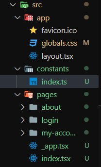

# Rotas Protegidas com Next.js, TypeScript e React Router Dom

A segurança é uma preocupação primordial ao desenvolver aplicações web modernas. Garantir que apenas usuários autenticados e autorizados tenham acesso a determinadas partes do seu aplicativo é essencial para proteger dados sensíveis e funcionalidades importantes. Então, vamos explorar como implementar rotas protegidas em uma aplicação `Next.js`. Além disso, vamos comparar a abordagem `Next.js` com uma aplicação React padrão usando `react-router-dom`.

## Parte 1: Implementando Rotas Protegidas com Next.js

Vamos começar criando rotas protegidas em uma aplicação `Next.js`. Vamos usar o `Next.js` para gerenciar o roteamento do lado do servidor e o TypeScript para garantir tipagem segura.

### 1.1 Criando uma Rota Protegida:

Primeiro, crie uma página protegida `account.tsx` na pasta pages. Esta será a página para a qual os usuários autenticados serão redirecionados.

```tsx
// pages/account.tsx
import { useRouter } from 'next/router';
import { useEffect } from 'react';

const AccountPage = () => {
  const router = useRouter();

  useEffect(() => {
    // Lógica de verificação de autenticação (pode ser um token em localStorage ou cookies)
    const isAuthenticated = true;

    if (!isAuthenticated) {
      router.push('/login'); // Redirecionar para a página de login se não estiver autenticado
    }
  }, []);

  return <div>Página da Conta Protegida</div>;
};

export default AccountPage;
```

### 1.2 Configurando as Rotas:

Configure suas rotas em pages/index.tsx:

```tsx
// pages/index.tsx
import Link from 'next/link';

const HomePage = () => {
  return (
    <div>
      <h1>Home</h1>
      <Link href="/account">Ir para a Página da Conta</Link>
    </div>
  );
};

export default HomePage;
```

## Parte 2: Comparação com React e react-router-dom

Vamos agora comparar esta abordagem com uma aplicação `React` padrão usando `react-router-dom`.

### 2.1 Implementando Rotas Protegidas com react-router-dom:

Para implementar rotas protegidas em uma aplicação `React` com `react-router-dom`, você pode usar um componente de rota personalizado.

```tsx
import { BrowserRouter as Router, Route, Redirect } from 'react-router-dom';

const PrivateRoute = ({ component: Component, isAuthenticated, ...rest }) => {
  return (
    <Route
      {...rest}
      render={(props) =>
        isAuthenticated ? <Component {...props} /> : <Redirect to="/login" />
      }
    />
  );
};
```

### 2.2 Configurando as Rotas com react-router-dom:

```tsx
import { BrowserRouter as Router, Route, Switch } from 'react-router-dom';

const App = () => {
  const isAuthenticated = true; // Lógica de verificação de autenticação

  return (
    <Router>
      <Switch>
        <Route path="/login" component={LoginPage} />
        <PrivateRoute
          path="/account"
          component={AccountPage}
          isAuthenticated={isAuthenticated}
        />
        <Route path="/" component={HomePage} />
      </Switch>
    </Router>
  );
};
```

## Conclusão: Comparando Next.js e React com react-router-dom

Ambas as abordagens oferecem soluções eficazes para rotas protegidas em aplicações `React`. O `Next.js`, com sua renderização do lado do servidor (`SSR`), oferece uma abordagem mais completa e integrada, especialmente quando a complexidade da aplicação aumenta.

Por outro lado, uma aplicação `React` padrão com `react-router-dom` oferece mais flexibilidade e controle sobre o roteamento, sendo adequada para aplicativos menores ou projetos mais simples.

A escolha entre essas abordagens dependerá dos requisitos específicos do seu projeto e do nível de complexidade que você está enfrentando. Independentemente da escolha, a segurança deve sempre ser uma prioridade, garantindo que apenas usuários autenticados e autorizados tenham acesso às partes sensíveis da sua aplicação.

## Desafio

Vamos praticar a estratégia de proteção de rotas apresentada em aula:

1. Primeiramente precisa criar o projeto e escolher a opção de instalar o `appRouter` nas perguntas do comando `npx create-next-app`
2. Depois precisa criar a pasta `pages` dedntro de `src` com as suas rotas definidas:



3. Apague o arquivo `page.tsx` dentro da pasta `app`, pois usaremos o arquivo `src/pages/index.tsx` como a página **Home** do site
4. Crie o arquivo `_app.tsx` dentro da pasta `pages`, pois tudo que fizermos dentro dele vai ser distribuido para todas as páginas

```tsx
import type { AppProps } from "next/app";
import "@/app/globals.css";
import { usePathname, useRouter } from "next/navigation";
import { checkIsPublicRoute } from "@/utils";
import { useEffect } from "react";

export default function App({ Component, pageProps }: AppProps) {
  const path = usePathname();
  const { replace } = useRouter();

  const isPublicRoute = checkIsPublicRoute(path!);

  const isAuthenticated = true;

  useEffect(() => {
    if (!isPublicRoute) {
      replace("/login");
    }
  }, []);

  console.log({ path, isPublicRoute });

  return (
    <>
      {!isPublicRoute && null}
      {isPublicRoute && <Component {...pageProps} />}
    </>
  );
}
```

5. Depois crie o arquivo `src/constants/index.ts` para definirmos as rotas publicas e privadas do nosso site:

```ts
export const APP_ROUTES = {
  public: {
    home: "/",
    about: "/about",
    login: "/login",
  },
  private: {
    "my-account": "/my-account",
    dashboard: "/dashboard",
  },
};
```

6. Crie o arquivo `src/utils/index.ts` para adicionar a função que retornará se tal rota é publica ou é privada:

```ts
import { APP_ROUTES } from "@/constants";

export const checkIsPublicRoute = (path: string) => {
  const publicRoutes = Object.values(APP_ROUTES.public);
  return publicRoutes.includes(path);
};
```


